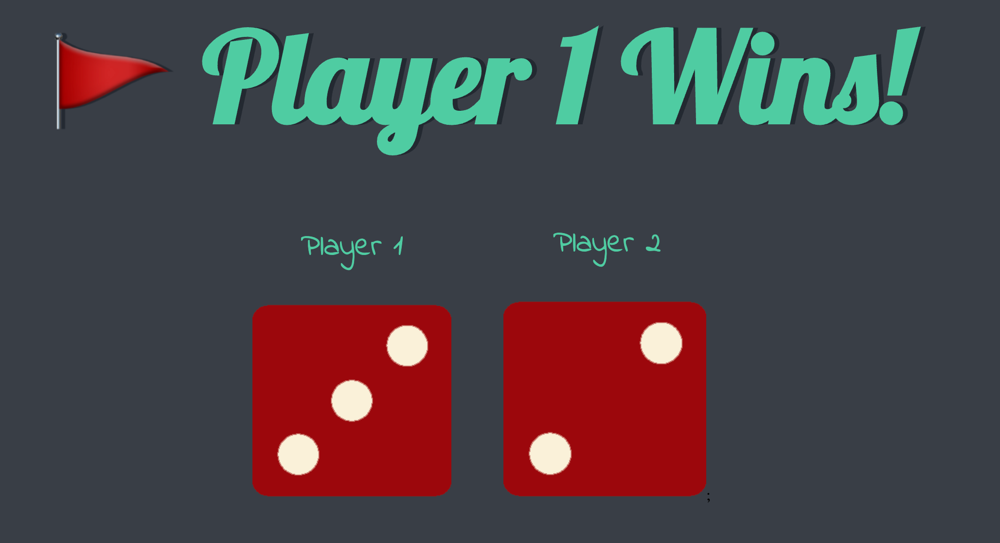

# Dice Game

## Overview

This Dice Game is a simple, web-based game where two players roll dice and the one with the higher roll wins. The game is built using HTML, CSS, and JavaScript.

## How to Play

-   Open the `dicee.html` file in a web browser.
-   The game will display two dice images, each representing a dice roll for Player 1 and Player 2.
-   To roll the dice, simply refresh the page.
-   The player with the higher dice roll wins. The game displays a winning message at the top of the page.
-   If both players roll the same number, the game declares a draw.

## Files in This Project

-   `index.js`: Contains the JavaScript code to generate random dice rolls and update the game's outcome.
-   `dicee.html`: The main HTML file. Open this file in a browser to play the game.
-   `styles.css`: Contains the CSS styles for the game.
-   `images/`: A directory containing the dice images (`dice1.png` to `dice6.png`).

## License

This project is developed as a part of the learning process from the (The Complete 2023 Web Development Bootcamp)[https://www.udemy.com/course/the-complete-web-development-bootcamp/] by The App Brewery, available on Udemy. The original concept and instructional content for this project are credited to The App Brewery.

The implementation code in this repository is released for educational purposes and personal use. It is not licensed for commercial use, redistribution, or derivative work without explicit permission from The App Brewery.
